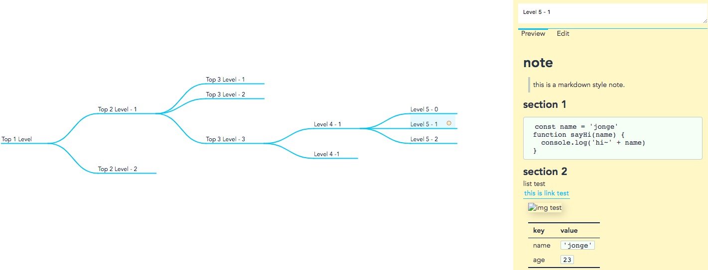

# mmm-mind

> A markdown <--> mind map tool. Checkout [onlne demo](https://noname4me.github.io/solutions/mind-map/index.html).

⚠️：only support indent size of **2 spaces**.

## Project setup

```bash
yarn install

yarn run serve

yarn run build

yarn run test

yarn run lint

yarn run test:unit
```

## usage

示例：



源 markdown 文件如下：

```md
# Top 1 Level

## Top 2 Level - 1

### Top 3 Level - 1

### Top 3 Level - 2

### Top 3 Level - 3

- Level 4 - 1

  - Level 5 - 0

  - Level 5 - 1
    # note
    
    > this is a markdown style note.
    
    ## section 1
    ```js
    const name = 'jonge'
    function sayHi(name) {
      console.log('hi~' + name)
    }
    ```
    
    ## section 2
    
    * list test
    
    [this is link test](./link)
    
    
    |key|value|
    |-|-|
    |name|`'jonge'`|
    |age|`23`|

  - Level 5 - 2

- Level 4 -1

## Top 2 Level - 2
```

## task

- [ ] 右键菜单？
- [ ] 连接
- [ ] 缩放/平移：以当前视窗中心为中点进行缩放
- [ ] 导入导出（file/复制粘贴）
- [ ] 黑夜/白昼模式
- [ ] 设置颜色
- [ ] 键盘支持：折叠/新建/删除/复制粘贴
